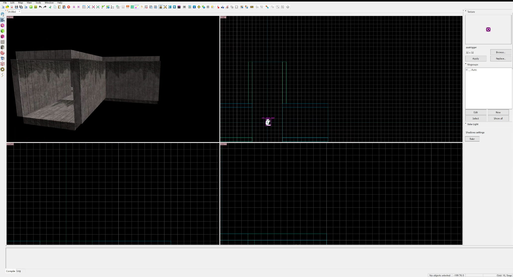

# HammerTimeMCP

HammerTimeMCP is a Model Context Protocol (MCP) plugin for HammerTime. It lets AI assistants connect to the running HammerTime editor, inspect maps, and perform editor actions through a controlled tool interface.

The project keeps HammerTime as the source of truth. The AI client talks to `hammertime-mcp.exe`, and the CLI forwards requests to the HammerTime plugin over a local authenticated named pipe.

```text
AI client -> hammertime-mcp.exe -> named pipe -> HammerTime.Mcp.Plugin -> HammerTime editor
```

## Features

- Inspect open documents, selections, entities, brushes, textures, faces, and map bounds.
- Create and edit brushes, entities, brush entities, prefabs, overlays, cordons, and texture data.
- Move, rotate, scale, delete, select, focus, highlight, and search map objects.
- Run map validation, problem checks, safe fixes, leak pointfile loading, compile profiles, undo, and redo.
- Configure common MCP clients through the included installer.

## Watch HammerTimeMCP in action:

[](https://github.com/BlackShadow/HammerTime-MCP/blob/main/media/Hallway-Demo.mp4)

## Project Layout

```text
HammerTime.Mcp.Cli\       MCP stdio server and installer commands
HammerTime.Mcp.Plugin\    HammerTime editor plugin and named-pipe bridge
HammerTime.Mcp.Shared\    Shared protocol, DTOs, config, and tool catalog
HammerTime.Mcp.Tests\     MSTest coverage for bridge/tool metadata
MCP-Install\              Generated install bundle
```

## Requirements

- Windows.
- HammerTime installed or built locally.
- .NET 8 runtime for the MCP server.
- Visual Studio 2022 or the .NET SDK to build from source.

## Build

```powershell
dotnet build .\HammerTime.MCP.sln -c Debug /p:Platform="Any CPU"
```

This refreshes the install bundle under `MCP-Install\Server` and `MCP-Install\Plugin`.

If HammerTime is in a custom location, pass its editor output path:

```powershell
dotnet build .\HammerTime.MCP.sln -c Debug /p:Platform="Any CPU" /p:HammerTimeEditorOutput="C:\Path\To\HammertimeEditor\"
```

## Install

Run the bundled installer:

```powershell
.\MCP-Install\install.bat
```

The installer can configure several MCP clients, including Codex, Cursor, VS Code, Claude, Windsurf, OpenCode, Kimi Code, Antigravity, and Gemini CLI.

To install specific clients without the menu:

```powershell
.\MCP-Install\install.bat codex,cursor,vscode user
```

If HammerTime is not detected automatically:

```powershell
.\MCP-Install\install.bat codex user "C:\Program Files (x86)\HammertimeEditor"
```

Restart HammerTime after installing or updating the plugin.

## Verify

With HammerTime running, check the bridge:

```powershell
.\MCP-Install\Server\hammertime-mcp.exe status
```

For diagnostics:

```powershell
.\MCP-Install\Server\hammertime-mcp.exe doctor
```

Run tests:

```powershell
dotnet test .\HammerTime.MCP.sln -c Debug /p:Platform="Any CPU"
```

## Notes

The bridge config is stored at:

```text
%APPDATA%\HammerTime.MCP\config.json
```

HammerTimeMCP controls the live editor state. Review AI-driven changes before saving important maps, and keep backups or version control for serious work.


